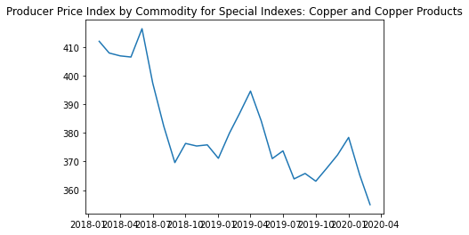
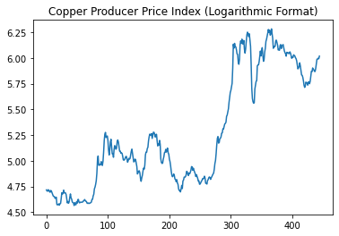
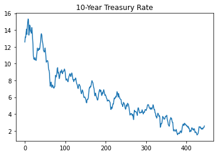
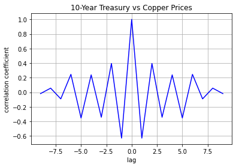
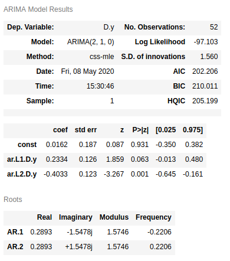
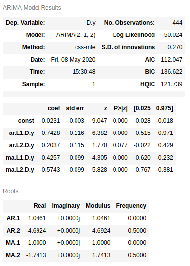
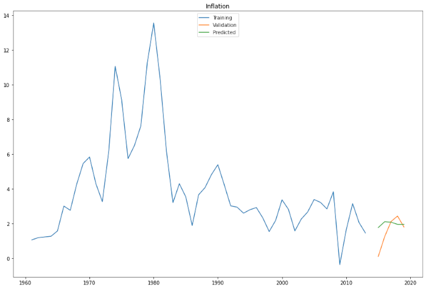
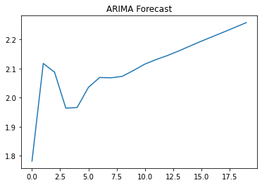
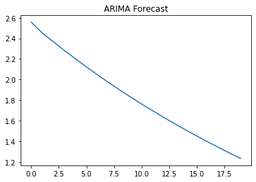
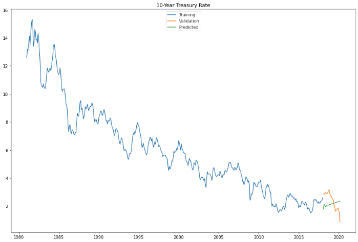

[Home](https://mgcodesandstats.github.io/) |
[GitHub](https://github.com/mgcodesandstats) |
[Speaking Engagements](https://mgcodesandstats.github.io/speaking-engagements/) |
[Terms](https://mgcodesandstats.github.io/terms/) |
[E-mail](mailto:contact@michael-grogan.com)

# Copper Prices After COVID-19: A Time Series Analysis

*Published on 9 May 2020*

With COVID-19 proving to be a game-changer from both a health and economic perspective, the commodity market has been hit particularly hard.

Copper prices have seen a significant slump in the first quarter of 2020. According to the [World Bank](https://blogs.worldbank.org/voices/outlook-commodity-markets-and-effects-coronavirus-six-charts), this is in large part due to the large decline that we have been seeing in the manufacturing sector and stimulus measures are having a limited effect in supporting prices.


Accordingly, the producer price index has also been falling.



However, is it necessarily a given that we can expect these trends to continue looking forward?

To answer this question, let's consider a time series analysis using the following:

- Cointegration
- Cross-correlation
- Forecasting of inflation and 10-Year US Treasury Rates with ARIMA

Given that copper prices are stochastic in nature (i.e. follow a random walk), forecasts are not made using copper prices outright. Rather, this analysis investigates the correlations between copper and the 10-year US Treasury Rate, with a view to inferring the potential direction for copper from forecasts of US inflation and the 10-year US Treasury Rate.

For the purposes of this analysis, the copper price producer index and the 10-year US Treasury Rate is split into the following time periods for training and validation purposes:

**Training:** January 1981 to January 2018

**Validation:** February 2018 to March 2020

The relevant time series were sourced from the FRED (Federal Reserve Economic Data) source through Quandl.

The sourced time series are as follows:

- 10 Year Treasury Constant Maturity Rate (FRED/GS10)

- Producer Price Index by Commodity for Special Indexes Copper and Copper Products (FRED/WPUSI019011)

- U.S. Inflation Data (FRED/FPCPITOTLZGUSA)

The producer price index and 10-year treasury data is in monthly format and the U.S. inflation data is in yearly format.

## Cointegration and Cross-Correlation

When working with time series analysis, cointegration testing is used in order to determine whether correlations between two time series are theoretically relevant or simply due to chance.

In addition, cross-correlation is used to infer whether there is a leading or lagging relationship between the two indicators, e.g. US GDP is typically a **lagging** indicator for the S&P 500, while the S&P 500 is conversely a **leading** indicator for US GDP.

### Cointegration

A cointegration analysis is conducted between the 10-year US Treasury rate and the copper producer price index for both the training and validation data. Note that copper prices are converted into logarithmic format for this purpose, while the 10-year US Treasury rate remains in its original format.

Here are the results for the training set:

```
>>> coin_result_1 = ts.coint(treasurynp, copperlog)
>>> coin_result_1
(-3.118624703597714,
 0.08462298746786284,
 array([-3.92127651, -3.3499261 , -3.05401605]))
```

With a p-value of **0.08**, this implies that long-run cointegration between copper and the 10-year US Treasury yield is present at the 10% level of significance.

However, when testing for cointegration on the validation set, we see that the p-value is highly insignificant at **0.88**.

```
>>> coin_result_2 = ts.coint(treasuryvalnp, coppervallog)
>>> coin_result_2
(-1.0698051835455291,
 0.8887881547454453,
 array([-4.3881592, -3.5914508, -3.21845  ]))
```

These results imply that the relationship between the producer price index and the 10-Year US Treasury rate has deviated from its long-run pattern. We can see that over time, the producer price index has seen a long-term rise while the 10-Year Treasury Rate has seen an extended decline.





### Cross-Correlation

A cross-correlation analysis demonstrated that changes in the copper price index and the 10-Year US Treasury Rate on a monthly basis do not generally demonstrate any time lags between the two. That said, some meaningful correlations are observed for up to a three-month lag period.



## ARIMA: Inflation and 10-Year US Treasury Rate Forecast

As mentioned, copper prices resemble a stochastic process and therefore it was not deemed appropriate to forecast future movements of this commodity directly.

However, ARIMA is used in this case for forecasting US inflation and the 10-Year US Treasury Rate, with a view to inferring a potential path for the copper producer price index going forward.

The inflation data used is on a yearly basis dating back to January 1960, while the US 10-Year Treasury data used is the same as that used for the cointegration and cross-correlation analyses above.

The ```pyramid.arima``` library in Python is used to run an **auto_arima** model whereby the ARIMA coordinates are automatically selected to find the best fit model.

The appropriate model as identified for forecasting inflation is as follows:



The appropriate model as identified for forecasting the 10-year US Treasury Rate is as follows:



### Inflation

The ARIMA forecast for inflation yields an RMSE (root mean squared error) of **0.866** on the validation set.



The forecast for the next 20 months predicts a significant rise in inflation:



### 10-Year US Treasury Rate

The ARIMA forecast for the 10-Year US Treasury Rate yields an RMSE of **0.756** on the validation set.



The forecast for the next 20 months predicts a continued drop in the 10-Year US Treasury Rate:



## Interpretation

### There could be a case for higher inflation going forward

With the effects of the COVID-19 pandemic on the economy, central banks around the world have moved to cut interest rates. With that being said, there is only so much quantitative easing that the economy can absorb before prices increase. This is particularly the case if the economy recovers faster than expected and consumers take advantage of lower rates, in turn pushing prices up. From this standpoint, the ARIMA forecast of rising inflation rates may be theoretically justified.

The ARIMA forecast for the 10-Year US Treasury Rate indicates a downward trend, which would be contrary to expectations in a period rising inflation. However, with the 10-year yield indicating low inflation expectations at present, we could see a situation where yields start rising if inflation grows faster than expected.

### Copper and 10-year US Treasury Rate deviating from long-run relationship

This may be one of the reasons we are seeing the copper producer price index and the 10-year Treasury rate deviate from their long-run relationship based on the previous cointegration analysis. The long-run relationship between copper and the 10Y rate has been negative, i.e. copper prices have risen while the 10Y rate has fallen. However, we are now seeing a situation where both time series are declining.

### Implications for copper prices

The long-run relationship as indicated by the cointegration analysis would suggest that the two series cannot move in the same direction indefinitely. It is likely that both copper prices and Treasury yields will continue to fall during the COVID-19 recession.

Should yields continue falling, then copper prices will eventually start rising under this model. This contradicts expectations in the short-term since lower yields imply lower inflation - which means lower cost of production for copper. However, the long-run implication is that lower prices eventually bolster consumer spending - and copper prices rise to reflect future expectations of higher consumer spending.

On the other hand, a limitation of this analysis is that the 10-year US Treasury yield has predominantly been falling since 1980. Therefore, while the relationship between copper and the 10-year Treasury has been negative over this period, it cannot be assumed that the relationship would remain negative if bond yields suddenly started rising. Indeed, what might be more likely to happen is that copper prices would also rise under this scenario given that 1) the metal tends to be used as a hedge against inflation and 2) higher cost of production means that producers must hike prices in order to maintain profitability.

## Conclusion

The following analysis has attempted to investigate a potential future trajectory for the copper producer price index. using US inflation and 10-Year Treasury yield forecasts. Many thanks for reading, and the GitHub repository with associated code and findings can be found [here](https://github.com/mgcodesandstats/economics-time-series).

*Disclaimer: The above is simply an illustration of time series analysis methods on the topic in question and is presented "as is". None of the above is meant as any form of investment advice, or advice of a professional nature. COVID-19 is an ongoing situation, and the above analysis reflects the author's opinion at the time of writing only - no warranties are made as to the accuracy of the above information for any purpose.*
